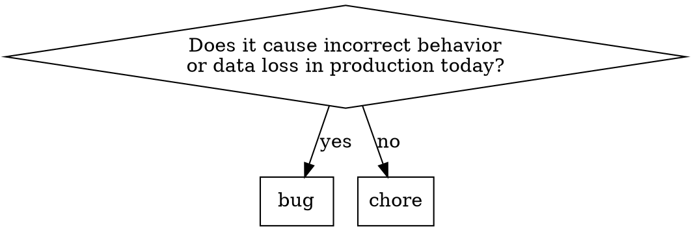

# File Findings

## Overview

Turn code review findings from the current session into self-contained Trello cards. Each card must be actionable by a brand new Claude instance with zero session context.

**This is NOT file-bug.** file-bug captures a single bug encountered during work. This skill batch-files multiple findings from a completed code review.

## The Process

### Phase 1: Parse Finding Identifiers

The user provides finding identifiers (e.g., "02 03 04") that reference findings from a code review run earlier in this session.

For each identifier:
1. Search the current conversation for the matching finding in review output
2. Extract: file path(s), line numbers, what's wrong, suggested fix direction, relevant code snippets, and severity/type (bug vs chore)

If a finding identifier cannot be matched to review output in this session, report it and skip.

### Phase 2: Classify Each Finding

The only valid labels are `bug` and `chore`. Do NOT use review severity levels (warning, error, info) as labels — those are not Trello labels.



- `bug` — Causes wrong behavior NOW: security vulnerability, data corruption, race condition producing incorrect results, broken functionality
- `chore` — Everything else: missing index (perf), hardcoded config, style, naming, refactoring, dead code, test coverage gap, code organization

A missing index causing slow queries is a `chore`. A SQL injection vulnerability is a `bug`. The distinction is correctness, not severity.

### Phase 3: Compose Card Content

**Title rules:**
- Clear, actionable description of what needs to change
- Do NOT prefix with "Bug:" or "Chore:" — the label carries that
- Do NOT reference review-cycle identifiers (MOD-03, F-07, P-12, etc.)
- Good: "Add database index on email_messages.thread_id"
- Bad: "Fix MOD-03" or "Bug: Missing index"

**Description template:**

```
## What's Wrong

[Describe the problem in plain language. Include file path(s) and line number(s).
Do NOT reference review severity (Warning, Error) or review identifiers.]

## Code Context

[Include the CURRENT code that has the problem — the actual snippet from the
codebase. A new Claude instance needs to see what's there today, not just
what the fix looks like.]

## Fix Direction

[Concrete guidance on what the fix looks like. Include the fix approach AND
example code if the review provided it. Not just "fix it" — describe the approach.]
```

The description must be **fully self-contained**. A brand new Claude instance with no session history must be able to complete the task from the description alone. Do not reference other findings, review identifiers, review severity labels, or session context.

### Phase 4: Create Cards

For each finding:

```bash
bin/trello card new "<actionable title>" \
  --description "<self-contained description>" \
  --label <bug|chore> \
  --position top
```

`--position top` and `--label` are REQUIRED on every card. No exceptions.

If the finding includes a code snippet longer than 15 lines, save it to a temp file and attach it:

```bash
bin/trello attach upload <card-ref> <temp-file>
```

### Phase 5: Report

After all cards are created, report a summary table:

```
| # | Title | Label | URL |
|---|-------|-------|-----|
| 1 | Add database index on email_messages.thread_id | chore | https://trello.com/c/abc123 |
| 2 | Fix SQL injection in reports sort parameter | bug | https://trello.com/c/def456 |
```

Nothing more. Don't rehash the findings.

## Red Flags

If you catch yourself doing these, STOP:

- **Putting "Bug:" or "Chore:" in the title** — The label carries the type
- **Using review identifiers in the title or description** — MOD-03, F-07, P-12, etc. have no meaning outside this session
- **Using review severity as a label** — `--label warning` and `--label error` are wrong. Only `bug` and `chore` exist.
- **Writing a vague description** — "Fix the issue in this file" is useless. Include paths, lines, code, and fix direction.
- **Omitting the current broken code** — The Code Context section must show what's there TODAY, not just the fix
- **Referencing other findings** — Each card is independent and self-contained
- **Referencing review context** — No "as noted in the review", "Warning —", or severity prefixes in descriptions
- **Asking the user to describe the findings** — You ran the review, you have the context
- **Forgetting --position top** — Cards go to top of Inbox, always
- **Forgetting --label** — Every finding card needs bug or chore

## Quick Reference

| Phase | Action | Output |
|-------|--------|--------|
| 1. Parse | Match identifiers to review output | Finding details |
| 2. Classify | bug (broken now) vs chore (everything else) | Label per finding |
| 3. Compose | Apply template, include current code, no review refs | Title + description |
| 4. Create | `card new` with --label and --position top (REQUIRED) | Cards created |
| 5. Report | Summary table with titles and URLs | Done |
